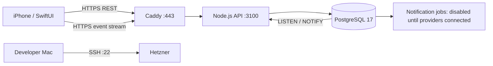

# Torly: native app and server

## Topology

One server is enough for the prototype architecture. Database and API ports are not
published. Caddy terminates TLS. The app never receives database or SSH credentials.
This is a single-host deployment, not a highly available cluster.

## Implemented in this change

- PostgreSQL schema and versioned, transactional migrations.
- Provisioned owner accounts, salted scrypt password hashes, expiring/revocable
  opaque sessions; the iPhone stores session tokens in Keychain.
- Ownership checks on every private route. Public profiles expose an explicit
  field allowlist, and new businesses start unpublished.
- Expandable category table, business timezone/currency/locale/country, separate
  employee hours, inactive services until price and duration are provided.
- Availability uses Luxon/IANA zones and UTC instants, including DST changes.
- Appointments snapshot price, duration and service name. Database exclusion
  constraint prevents overlaps with bookings, breaks and leave. Intervals are [start,end).
- Booking creation is idempotent per request UUID. Optimistic revision checks
  protect confirmation, cancellation and rescheduling against stale edits.
- Client cards are stored per business. No-show increments are transactional.
- PostgreSQL notifications are emitted at commit. Authenticated SSE streams tell
  active iPhones to refetch. Reconnection also refetches missed changes.
- SwiftUI live owner flow: server login, calendar date selection, staff/service
  selection, free times, booking creation, confirmation/cancellation, service editing,
  and separate staff hours. Existing concept screens remain under “Посмотреть демо”.
- Notification outbox schema with due date, delivery status and micro-USD cost.
  Jobs stay `disabled`: no messages or fictional delivery confirmations are sent.
- Docker Compose, Caddy HTTPS config and a PostgreSQL backup command with a daily systemd timer.

The main plan is 3900 ILS minor units per month. Billing is not enabled.

## Not yet connected

- Self-service account registration, Apple/Google login and password recovery.
- Client authentication, public booking mutations, business publishing controls,
  profile photo storage and fully connected multi-step business onboarding.
- Break/leave editors and staff/service creation (the occupancy schema supports them).
- Native rescheduling UI (API supports rescheduling).
- WhatsApp templates, consent, credentials, provider webhooks, quota reservations,
  retry worker, waitlist notifications, push/APNs and calendar integrations.
- Reviews, forms, reports, payment collection and subscription enforcement.
- Automatic off-server backup rotation and external uptime monitoring.

No tax receipts, accounting or fiscal inventory are part of this stage.

## WhatsApp next step

Keep provider credentials server-side. Add consent records and approved utility
templates per language. A worker claims due jobs with `FOR UPDATE SKIP LOCKED`,
rechecks booking state/revision and quota, then records the provider message ID.
Verify webhook signatures and deduplicate delivery events. Record actual charged
cost by recipient market and category; do not assume Israeli prices worldwide.
Add worker network egress only when the provider is connected. The API currently
runs on an internal-only Docker network and cannot send external requests.

## Prototype deployment gates

1. Verify SSH access to the newly created server, then inspect existing services.
2. Install Docker/Compose, allow SSH/HTTP/HTTPS and preserve current SSH access.
3. Point a controlled domain at the server and set `.env` locally on that server.
4. Build containers, migrate the database, provision the private test business.
5. Verify HTTPS health, auth, booking persistence, real concurrent conflict handling
   and SSE on actual PostgreSQL; test from two app sessions.
6. Take a backup and restore it into a separate test database.
7. Install a signed iPhone build using the owner's Apple development team.

Local tests use PGlite (PostgreSQL WASM with btree_gist) to execute the real schema
and HTTP API. `TORLY_VERIFY_PG=1` runs the same suite on an isolated `torly_verify`
PostgreSQL database and additionally checks simultaneous requests and SSE delivery.

## Deployment verified 2026-09-06

- HTTPS API at `https://torly.cybermemo.dev`, using a dedicated DNS record in Cloudflare.
- PostgreSQL/API/Caddy running on the user's Hetzner server. The domain root is unchanged.
- Private owner business provisioned; real contact data is excluded from Git.
- Five tests passed on actual PostgreSQL, including concurrent overlap rejection and SSE.
- Daily backup timer active at 03:00 UTC. Initial backup restored into a separate database.
- iPhone Simulator build succeeded, signature verified, app installed and launched.

The hostname currently serves the API, not a finished public booking website.
The public business starts unpublished. Owner login details are in a separate
local private file, never embedded in the app or committed to GitHub.
